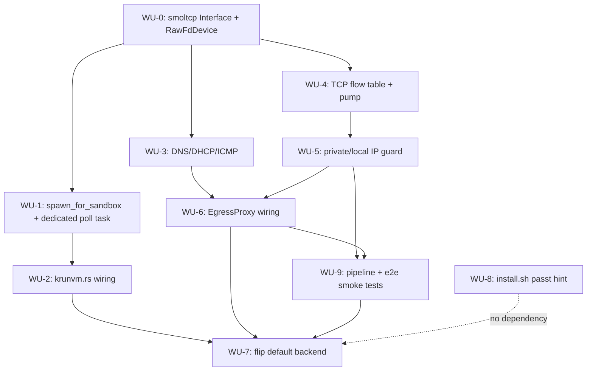

# ADR-019 Execution Blueprint

- **Parent ADR:** docs/adr/019-inprocess-smoltcp-networking.md

## System Snapshot

- `ward-net/src/lib.rs:84-100` — `NetworkBackend` trait (`name`/`probe`/`attach`/`detach`), implemented by `PasstBackend`, `GvproxyBackend`, `NullBackend`, `SmoltcpBackend`. **Note:** the trait's `attach`/`detach` are bookkeeping only for both existing backends (`PasstBackend::attach` at `ward-net/src/passt.rs:162-178` records an attach id and a placeholder pid; `GvproxyBackend::attach` at `ward-net/src/gvproxy.rs:160-174` does the same). The real per-sandbox boot path for both is the free function `spawn_for_sandbox`, called directly from `krunvm.rs:255,266`. `SmoltcpBackend` follows the same split.
- `ward-net/src/smoltcp_backend.rs` — scaffold. `probe()` returns `Ok`; trait `attach` returns `Error::Unimplemented` (lines 40-47); `detach` already returns `Ok(())` (lines 49-51), not `Unimplemented`. `ward-net/src/smoltcp_backend.rs:63-73` also holds an existing test, `given_scaffold_when_attach_then_unimplemented`, asserting today's `Error::Unimplemented` behavior — WU-1 changes `attach` to bookkeeping-only (matching `PasstBackend`), which breaks this test; WU-1's Files list below now includes updating/removing it.
- `ward-net/Cargo.toml:25,41-48` — `smoltcp` feature gates `dep:smoltcp = "0.13"` with `["std", "medium-ethernet", "proto-ipv4", "socket-tcp", "socket-udp", "log"]`. Missing `socket-dns`, `socket-dhcpv4`, `socket-icmp` for the work below.
- `ward-core/Cargo.toml:62` — `ward-net = { path = "../ward-net", features = ["passt", "gvproxy"] }`. Does **not** include `"smoltcp"` — WU-2 must add it, or `ward_net::smoltcp_backend` is not in scope for ward-core.
- `ward-core/src/backend/krun_ffi.rs:104-119` — raw FFI: `krun_add_net_unixstream` and `krun_add_net_unixgram` are each **six-argument** functions: `(ctx_id: u32, c_path: *const c_char, fd: c_int, c_mac: *mut u8, features: u32, flags: u32) -> i32`, not the two-argument shape `set_passt_fd` has. `c_path`, `c_mac`, `features`, and `flags` are real parameters, not padding: `features`/`flags` negotiate virtio-net options that determine whether each frame on the FD carries a virtio-net header ahead of the Ethernet frame, and `c_mac` sets the link address the smoltcp `Interface` must answer for. WU-1's safe wrapper and WU-0's `RawFdDevice` wire format both depend on getting this right — see WU-1's Open Item on this.
- `ward-core/src/backend/krun_ffi.rs:120,127-129` — `krun_add_net_tap` (rejected, needs root), `krun_set_passt_fd`/`krun_set_gvproxy_path` (used today, lines 263-324 hold their safe wrappers).
- `ward-core/src/backend/krunvm.rs:128` — `KrunvmBackend.sandboxes: Arc<tokio::sync::RwLock<HashMap<String, SandboxState>>>` (the `RwLock` import itself is at line 12; the field is declared at line 128). A per-sandbox object that needs continuous polling (like a smoltcp `Stack`) must NOT live behind this lock if polling it involves `.await`ing network I/O — that would hold a daemon-wide lock across an await, the same bug class the repo audit flagged at `ward-core/src/sandbox/manager.rs:456,522` (not in this file; no lock-across-await bug is currently known in `krunvm.rs` itself, but the risk this WU avoids is the same class). WU-1 addresses this by giving each sandbox's `Stack` its own dedicated tokio task instead.
- `ward-core/src/backend/krunvm.rs:88-107` — `SandboxState` (not `KrunvmBackend`) holds `passt: Option<PasstHandle>`, `gvproxy: Option<GvproxyHandle>` per-sandbox state. `KrunvmBackend` itself starts at line 127 and holds the shared `sandboxes` map (above), not per-sandbox fields directly.
- `ward-core/src/backend/krunvm.rs:251-278` — sandbox-create match on `self.network_backend`; `Passt`/`Gvproxy` arms spawn + wire an FD; `_` (covers `None`/`Smoltcp`) falls through to `(None, None)`, i.e. no network.
- `ward-core/src/config.rs:11-24` — `NetworkBackendChoice` enum, `#[default]` on `Passt`.
- `ward-core/src/config.rs:34-42` — `parse_network_backend` string parser (already accepts `"smoltcp"`).
- `ward-core/src/egress/proxy.rs:42-63` — `EgressProxy::new(sandbox_id, policy)` and `pub async fn check(&self, domain: &str, port: u16) -> bool`. This is the reusable library call (not the HTTP-CONNECT `serve()` path at line 127) — the flow table calls `check()` directly.
- `ward-core/src/egress/proxy.rs:165-206` — the existing CONNECT-proxy path's SSRF/DNS-rebinding guard: resolves the domain, checks the resolved address with `is_private_or_local` (a **private**, non-`pub` free function declared at line 274, called at line 187), and only then connects to the *resolved socket address*, not a second, independent lookup. This guard runs unconditionally, for every egress mode this path serves, not gated to any one `EgressMode` — the new smoltcp datapath's guard (WU-5) must match that: mode-unconditional, not Allowlist-only. Since `is_private_or_local` is private to `ward-core` and `ward-net` must not depend on `ward-core` (confirmed: `ward-core/Cargo.toml:62` depends on `ward-net`, not the reverse), WU-5 does not reuse this function directly — it reimplements the same private/loopback/link-local/multicast/unique-local range checks natively in `ward-net`, kept behaviorally equivalent to `proxy.rs:274`'s ranges by both citing the same RFC ranges, not by a shared dependency. This means WU-5 does **not** need WU-6's callback plumbing to exist first — it is a pure IP-classification check with no `EgressProxy` state involved, and can be implemented and tested independent of WU-6's egress-check callback, even though it must still run before WU-6's check in `Stack::poll_flows`'s actual control flow. The new smoltcp datapath needs the equivalent guard applied to *guest-chosen destination IPs*, not just resolved-then-connect: WU-5 exists specifically because the smoltcp datapath's threat model is different (guest picks the destination IP directly; DNS only supplies a label for allowlist matching, and that label cannot be trusted to gate anything by itself).
- `ward-core/src/egress/proxy.rs:328-338` — `matches_domain(pattern, domain)`: wildcard-suffix or exact case-insensitive string match, no IP awareness. An unresolved destination IP passed as the "domain" string will fail essentially every domain-pattern allowlist entry and be denied — this is the actual (fail-closed) behavior for unresolved IPs, stated here explicitly because an earlier draft of this blueprint mischaracterized it as "existing domain-or-IP handling" that does not exist in `matches_domain`.
- `ward-core/src/sandbox/manager.rs:182-190` — `SEC-ALLOWLIST` comment + hard rejection of `EgressMode::Allowlist`. This is the line to remove once the datapath exists.
- `ward-net/tests/passt_spawn.rs`, `ward-net/tests/gvproxy_spawn.rs` — existing integration test pattern: feature-gated module, availability probe with `eprintln!("SKIP: ...")` early-return, no hard failure when the dependency is absent. `.github/workflows/` has no `passt` reference anywhere (confirmed by grep) — these tests run only in the non-gating coverage job (`ci.yml:492-497`, default features), never in a required/gating job, so a broken passt path would not block a PR today. The new default-backend flip (WU-7) MUST NOT repeat this pattern: WU-9's fake-hardware pipeline test is wired into a gating CI job with no skip gate.
- `install.sh:414-428` — the `sudo apt install passt` hint sits inside the same conditional block as `sudo usermod -aG kvm $USER` (line 422), which is the actual, unavoidable Linux `sudo` requirement for KVM access, unrelated to networking. WU-8 removes only the passt-specific line; it does not and cannot make the default install path sudo-free.

## Work Units

### WU-0: smoltcp Interface + raw virtio-net device over a Unix datagram FD

- Requires: nothing
- Goal: A `ward-net::smoltcp_backend::RawFdDevice` implementing smoltcp's `phy::Device` trait (`receive`/`transmit`/`capabilities`) that reads/writes raw Ethernet frames on a `std::os::fd::OwnedFd`, plus a `Stack` struct owning a smoltcp `Interface` + `SocketSet` driven by that device. No TCP/DNS logic yet — this WU only proves frames move in and out of the FD and `Interface::poll()` runs on a schedule. Malformed input handling is part of this WU, not deferred, since this is the first point untrusted guest bytes enter the process.
- Files:
  - `ward-net/Cargo.toml` — add `socket-dns`, `socket-dhcpv4`, `socket-icmp` to the `smoltcp` feature's feature list; also add `sync` and `net` to the `tokio` dependency's feature list (needed by WU-1 and WU-4 respectively) and a new `[dev-dependencies] tokio = { version = "1", features = ["test-util"] }` entry (needed by WU-4's deterministic timeout test) — consolidated here in WU-0 (the one WU with no dependencies) rather than split across WU-1/WU-4, since both would otherwise edit the same manifest line with no ordering between them (modify)
  - `ward-net/src/smoltcp_backend.rs` — replace the scaffold's body with `RawFdDevice`, `Stack::new(fd: OwnedFd) -> Stack`, `Stack::poll(&mut self) -> smoltcp::time::Instant` looping on `Interface::poll` (modify)
  - `ward-net/tests/smoltcp_device.rs` — new, unit-style test using a `socketpair(2)` (mirrors the pattern already in `ward-net/src/passt.rs:97-109`) to prove a frame written to one end of the pair is observed by `RawFdDevice::receive` on the other (new)
  - `.github/workflows/ci.yml` — add `--features smoltcp` to the clippy job's invocation (currently line 98, default features only), so this WU's own clippy Done When is enforced in CI, not just locally. This has no dependency on any other WU and belongs here, not in WU-9 (an earlier draft put it in WU-9, which made WU-0's own Done When depend transitively on WU-9, which itself depends on WU-0, an unsatisfiable cycle) (modify)
- Verification: `cargo test -p ward-net --features smoltcp --test smoltcp_device`
- Tests:
  - `given_frame_on_fd_when_receive_then_device_returns_it`
  - `given_device_when_transmit_then_frame_appears_on_fd`
  - `given_no_data_when_receive_then_returns_none_without_blocking`
  - `given_truncated_frame_on_fd_when_receive_then_device_drops_it_without_panic` (adversarial-input pin: first point untrusted guest bytes enter the stack)
  - `given_oversized_frame_on_fd_when_receive_then_device_drops_it_without_panic`
- Done When:
  - [ ] `RawFdDevice` round-trips a raw Ethernet frame through a `socketpair(2)` pair in a test with no smoltcp `Interface` involved (device-layer only)
  - [ ] A truncated or oversized frame is dropped (logged, not propagated) rather than panicking or being handed to smoltcp's `Interface` parser
  - [ ] `cargo clippy -p ward-net --features smoltcp --all-targets -- -D warnings` passes locally AND `.github/workflows/ci.yml`'s clippy job runs this same command with `--features smoltcp` in CI (this WU's own file-list change above, not a dependency on any later WU)

### WU-1: SmoltcpBackend::spawn_for_sandbox, with the Stack driven by its own dedicated task

- Requires: WU-0
- Goal: `spawn_for_sandbox(sandbox_id, opts) -> Result<SmoltcpHandle, Error>` allocates a `socketpair(AF_UNIX, SOCK_DGRAM)`, moves the host-side `OwnedFd` and a `Stack` into a **dedicated `tokio::task::spawn`ed task** that owns them exclusively and loops on `Stack::poll` plus a `tokio::sync::mpsc` command channel (shutdown, and later the connector/resolver callbacks). `SmoltcpHandle` holds only the guest-side FD to return to the caller, the task's `JoinHandle`, and the command channel's `Sender` — it does **not** hold the `Stack` itself, so nothing about polling this sandbox's network ever requires locking `KrunvmBackend`'s shared `sandboxes` map (see System Snapshot on `krunvm.rs:128`). `detach` sends a shutdown command and awaits the task's join. The trait's `attach`/`detach` methods stay bookkeeping-only, matching `PasstBackend`'s existing shape (System Snapshot) — they are not the production path. This WU also updates the existing test `ward-net/src/smoltcp_backend.rs:63-73` (`given_scaffold_when_attach_then_unimplemented`), which currently pins `attach`'s old `Error::Unimplemented` behavior and would otherwise fail once `attach` becomes a bookkeeping-only stub.
- Files:
  - `ward-net/src/smoltcp_backend.rs` — `SmoltcpHandle { guest_fd: RawFd, task: tokio::task::JoinHandle<()>, cmd_tx: mpsc::Sender<StackCommand> }`, `spawn_for_sandbox(sandbox_id, opts) -> Result<SmoltcpHandle, Error>`, `StackCommand` enum (starts with `Shutdown`; WU-3/WU-4/WU-5 add more variants as they need to inject collaborators); remove or rewrite `given_scaffold_when_attach_then_unimplemented` (lines 63-73) to match the new bookkeeping-only `attach` (modify) — needs `tokio::sync::mpsc` and `tokio::task::JoinHandle`, both covered by WU-0's `ward-net/Cargo.toml` feature additions (`sync`, already landed)
  - `ward-core/src/backend/krun_ffi.rs` — add a safe wrapper around `krun_add_net_unixgram`'s real six-argument signature (`ctx_id: u32, c_path: *const c_char, fd: c_int, c_mac: *mut u8, features: u32, flags: u32`, per System Snapshot — NOT the two-argument shape `set_passt_fd` has), e.g. `pub fn set_net_unixgram(ctx_id: u32, fd: RawFd, mac: Option<[u8; 6]>) -> Result<(), String>` that supplies `c_path` as null/unused (this transport doesn't bind a named socket path the way passt/gvproxy do — confirm this at implementation time), threads `AttachOptions.mac` through for `c_mac` (mirroring how `ward-net/src/passt.rs`'s `build_command_line` formats a MAC for passt's command line, not the test fixture at line 296 which only supplies one as test input), and passes `features`/`flags` values resolved by this WU's Open Item below (modify)
- Verification: `cargo test -p ward-net --features smoltcp` and `cargo test -p ward-core --features krunvm krun_ffi::`
- Tests:
  - `given_spawn_for_sandbox_when_called_then_returns_valid_guest_fd`
  - `given_spawned_task_when_shutdown_sent_then_task_joins_cleanly`
  - `given_spawn_then_detach_when_detach_again_then_idempotent` (same shape as `ward-net/src/passt.rs:304-311`)
- Done When:
  - [ ] `spawn_for_sandbox` returns a real, valid guest FD backed by a running task, not `Error::Unimplemented`
  - [ ] No code path polls a `Stack` while holding a guard on `KrunvmBackend::sandboxes` — verified by the task-ownership design above, not by a runtime assertion (this is a structural property of WU-1's design)
  - [ ] `krun_ffi::set_net_unixgram` matches `krun_add_net_unixgram`'s actual six-argument FFI signature, compiles under the `krunvm` feature, and has a `# Safety` doc comment matching the existing wrappers' convention
  - [ ] `ward-net/src/smoltcp_backend.rs:63-73`'s old test no longer asserts `attach` returns `Error::Unimplemented`; it's updated to match the new bookkeeping-only behavior or removed if superseded by this WU's own tests
- Open Item (must resolve before this WU's implementation starts, not deferred to WU-0's test-writing): confirm from libkrun's actual header (`vendor/` currently holds only a version pin and checksums, no header in-tree — obtain `containers/libkrun/include/libkrun.h` at the pinned version) what `features`/`flags` values `krun_add_net_unixgram` expects, and specifically whether the guest-side stream carries a virtio-net header ahead of each Ethernet frame. This determines WU-0's wire format; if a virtio-net header is present, WU-0's `RawFdDevice` must strip/prepend it, not treat the stream as bare Ethernet frames as currently scoped.

### WU-2: Wire NetworkBackendChoice::Smoltcp into krunvm.rs sandbox create

- Requires: WU-1
- Goal: The match at `krunvm.rs:254-278` gets a real `NetworkBackendChoice::Smoltcp` arm (spawn via `ward_net::smoltcp_backend::spawn_for_sandbox`, call `krun_ffi::set_net_unixgram`), instead of falling into the `_ => (None, None)` catch-all. `SandboxState` (not `KrunvmBackend` — see System Snapshot correction) gains a `smoltcp: Option<ward_net::smoltcp_backend::SmoltcpHandle>` field alongside `passt`/`gvproxy` (line 101-106), so the handle is per-sandbox, matching `passt`/`gvproxy`'s existing per-sandbox ownership; putting it on `KrunvmBackend` instead would make it daemon-global and have each new sandbox's handle silently overwrite the previous one's.
- Files:
  - `ward-core/Cargo.toml` — add `"smoltcp"` to `ward-net`'s feature list at line 62 (modify) — without this, `ward_net::smoltcp_backend` is not compiled into ward-core at all (System Snapshot)
  - `ward-core/src/backend/krunvm.rs` — add `smoltcp` field to `SandboxState` (near line 101-106), add `NetworkBackendChoice::Smoltcp` match arm (lines 254-278), thread the handle through sandbox teardown same as `passt_handle`/`gvproxy_handle` (modify)
- Verification: `cargo build -p ward-core --features krunvm,smoltcp && cargo test -p ward-core --features krunvm sandbox::`
- Tests:
  - `given_network_backend_smoltcp_when_create_sandbox_then_smoltcp_handle_set` (unit test at the `KrunvmBackend` level, using the existing stub-backend test harness pattern for sandbox creation)
- Done When:
  - [ ] `WARD_NETWORK_BACKEND=smoltcp` no longer results in a networkless sandbox
  - [ ] Sandbox teardown detaches the smoltcp handle (no FD/task leak) — verified by a test asserting the task's `JoinHandle` completes after teardown

### WU-3: DNS relay + DHCP/ICMP control-plane sockets in-stack

- Requires: WU-0
- Goal: `Stack` gains a `smoltcp::socket::dns::Socket` relaying guest DNS queries to the host's resolver, a `dhcpv4::Socket` so the guest interface gets an IP/gateway/DNS config on boot, and an `icmp::Socket` answering echo requests. The relay's upstream resolver is injected as a `Resolver` trait (`async fn resolve(&self, name: &str) -> Vec<IpAddr>`, or a plain boxed closure of that shape) that `Stack::new` takes by constructor injection — production wiring in WU-2 supplies a real `std::net::ToSocketAddrs`/UDP-relay impl, tests supply a fake returning canned answers. `Stack` records resolved `IpAddr -> domain` pairs from DNS responses it relays, in a bounded map (cap + eviction, mirroring the LRU pattern already used by `ward-core/src/backend/image.rs`'s cache), and only records a response whose transaction ID and source address match an outstanding query it issued — this map is what WU-5/WU-6 read, so unauthenticated entries would let a spoofed response mislabel an IP. **This map is a label for allowlist *matching* convenience only; it is never sufficient by itself to permit a flow — WU-5 gates on the destination IP's actual class (private/link-local vs public) before this label is ever consulted.**
- Files:
  - `ward-net/src/smoltcp_backend.rs` — `Stack` gains `resolver: Box<dyn Resolver>`, `dns_socket`, `dhcp_socket`, `icmp_socket`, `resolved: HashMap<IpAddr, String>` capped at e.g. 4096 entries with FIFO eviction, and an outstanding-query table keyed by transaction ID, itself capped (same order of magnitude as `resolved`, e.g. 4096 entries) with oldest-entry eviction or a short per-query expiry, since it is populated directly by guest-initiated queries and is exhaustible by a guest that floods queries without letting them resolve (modify)
- Verification: `cargo test -p ward-net --features smoltcp --test smoltcp_dns`
- Tests:
  - `given_guest_dns_query_when_relayed_then_fake_resolver_answer_returned` (fake `Resolver`, no live network — see Goal)
  - `given_dns_response_when_relayed_then_resolved_map_records_ip_to_domain`
  - `given_resolved_map_at_capacity_when_new_entry_then_oldest_evicted`
  - `given_dhcp_discover_when_polled_then_guest_gets_offer_with_gateway`
  - `given_spoofed_dns_response_wrong_transaction_id_when_relayed_then_resolved_map_unchanged` (adversarial-input pin)
  - `given_dns_response_from_unexpected_source_when_relayed_then_resolved_map_unchanged`
  - `given_outstanding_query_table_at_capacity_when_new_query_then_oldest_evicted_or_rejected` (guest-controlled exhaustion pin, same class as the flow table's capacity test in WU-4)
  - `given_guest_icmp_echo_request_when_polled_then_echo_reply_returned_with_matching_identifier_and_sequence`
- Done When:
  - [ ] A test guest-side DNS query against the `Stack`, driven through the WU-0 socketpair harness with a fake `Resolver` (no real network access), returns the fake's canned answer
  - [ ] A response with a mismatched transaction ID or unexpected source address is not recorded in `resolved`
  - [ ] `resolved` map never exceeds its cap across a fuzz-style loop of 10,000 synthetic DNS responses (regression pin against unbounded growth)
  - [ ] The outstanding-query table never exceeds its cap under a synthetic loop of guest queries that are never answered
  - [ ] An ICMP echo request against the `Stack` receives an echo reply with the request's identifier and sequence number preserved
  - [ ] A live-network smoke test (real resolver) exists only as a separate `#[ignore]`d test, not the WU-3 unit suite
  - [ ] Whether libkrun's guest kernel/init actually performs DHCP against `krun_add_net_unixgram` (vs. expecting a static guest IP) is confirmed before this WU's DHCP piece is built — see Open Items; if DHCP turns out not to be needed, this WU's `dhcp_socket` scope shrinks accordingly and the Done When above is updated to match, not silently dropped

### WU-4: TCP flow table + byte pump

- Requires: WU-0
- Goal: `Stack` gains a flow table `HashMap<(IpEndpoint, IpEndpoint), FlowState>` keyed by (guest src, dst), capped at a fixed maximum entry count with new-SYN-when-full rejected (RST), since this table is keyed by guest-controlled endpoints and is the most directly attacker-reachable structure in the stack. On a new guest SYN, the flow enters a `Connecting` state; once WU-5 and WU-6 approve it, `Stack` opens a connection via an injected `Connector` trait (`async fn connect(&self, addr: SocketAddr) -> io::Result<TcpStream>`, constructor-injected the same way WU-3 injects `Resolver`) rather than calling `tokio::net::TcpStream::connect` directly — production wiring supplies a real connector, tests supply a fake that can be told to hang or fail on command. `Stack` pumps bytes both directions via smoltcp's socket buffers once connected, mirroring the bidirectional-copy shape already used by `ward-core/src/egress/proxy.rs:220` (`tokio::io::copy_bidirectional`); that line plus the DNS lookup at `:178` and the connect loop at `:202` are the three call sites the repo audit found have no timeout — this WU's copy loop MUST wrap each side in `tokio::time::timeout`, closing the gap instead of reproducing it. The connector seam also doubles as WU-6's verification point: a fake connector with a call counter proves denied flows never reach it.
- Files:
  - `ward-net/src/smoltcp_backend.rs` — `FlowState` enum, `Connector` trait, `Stack::poll_flows(&mut self)`, flow-table capacity constant + eviction/rejection policy (modify) — needs `tokio::net::TcpStream` (`Connector` trait signature) and `tokio::time::pause`/`advance` (dev-only, for this WU's timeout test), both covered by WU-0's `ward-net/Cargo.toml` feature additions (`net`, `test-util`, already landed)
- Verification: `cargo test -p ward-net --features smoltcp --test smoltcp_flow`
- Tests:
  - `given_guest_syn_to_open_dest_when_polled_then_fake_connector_called_with_correct_addr` (fake `Connector`, no real socket)
  - `given_established_flow_when_guest_sends_bytes_then_host_receives_them`
  - `given_established_flow_when_host_sends_bytes_then_guest_receives_them`
  - `given_fake_connector_future_never_resolves_when_polled_then_flow_times_out_and_resets_within_timeout_window` (regression pin for the audit's "no timeout" finding; uses `tokio::time::pause`/`advance` against a fake connector whose future is `std::future::pending()`, not a real network hang, so the test is deterministic and fast)
  - `given_flow_table_at_capacity_when_new_syn_then_rejected_with_rst` (capacity pin, same shape as WU-3's `resolved`-map capacity test)
- Done When:
  - [ ] A synthetic flow through the WU-0 harness moves bytes both directions against a fake `Connector` backed by an in-test `TcpListener`
  - [ ] The timeout test uses `tokio::time::pause`/`advance` (no wall-clock sleep) and completes in well under a second
  - [ ] Flow table capacity test proves the table cannot grow unbounded from guest-controlled SYNs
  - [ ] Every host-side `.await` in the flow pump path has a `tokio::time::timeout`; `grep -n "\.read(\|\.write(" ward-net/src/smoltcp_backend.rs` shows no bare await without a wrapping timeout in the same function

### WU-5: Private/link-local destination guard (SSRF/DNS-rebinding defense)

- Requires: WU-4
- Goal: Before any egress decision is made for a flow (this includes `Open` mode, where `EgressProxy::check` always returns `true` — see `ward-core/src/egress/proxy.rs:68` — and `Allowlist` mode once WU-6 wires it), `Stack` checks the flow's **actual destination IP** (the guest-chosen address the SYN targets, not the DNS-derived label from WU-3's `resolved` map) against an `is_private_or_local`-equivalent check, natively implemented in `ward-net` (see System Snapshot: `ward-core`'s version is private and `ward-net` cannot depend on `ward-core`, so this WU reimplements the same private/loopback/link-local/multicast/unique-local range checks, not a shared call). A flow to a private, loopback, or link-local address (this explicitly includes `169.254.169.254`, the common cloud metadata address) is rejected with an RST **regardless of what domain label, if any, `resolved` associates with that IP, and regardless of `EgressMode`.** This is deliberately mode-unconditional: `ward-core/src/egress/proxy.rs:167-170`'s own comment on the existing guard states it protects "a sandbox in Open egress mode (or Allowlist with an IP literal)" — scoping this WU's guard to `Allowlist` only, as an earlier draft of this blueprint did, would ship it inert, since `Allowlist` is rejected at sandbox-create time until WU-6 lands and `Open` is the mode where this class of attack is actually reachable today. This closes the gap where a guest, or an attacker controlling DNS answers for an allowed domain, could otherwise point an allowed-looking label at a metadata or internal service. This WU does **not** depend on WU-6's egress-check callback plumbing: the guard is a pure IP-classification function with no `EgressProxy` state involved, so it can be implemented and tested standalone, even though in `Stack::poll_flows`'s actual control flow it must still run before WU-6's allowlist check for any flow that reaches that far.
- Files:
  - `ward-net/src/smoltcp_backend.rs` — `Stack::is_flow_destination_safe(&self, dst: IpAddr) -> bool` or equivalent (private/loopback/link-local/multicast/unique-local range checks, native to `ward-net`, behaviorally matched to `ward-core/src/egress/proxy.rs:274`'s ranges), called from `poll_flows` before any egress check, for every `EgressMode` this datapath serves (modify)
- Verification: `cargo test -p ward-net --features smoltcp --test smoltcp_ssrf_guard`
- Tests:
  - `given_flow_to_metadata_address_when_polled_then_rejected_regardless_of_resolved_label` (uses `169.254.169.254` with a `resolved` entry claiming an allowlisted domain, asserts rejection)
  - `given_flow_to_loopback_or_rfc1918_address_when_polled_then_rejected`
  - `given_flow_to_public_address_when_polled_then_reaches_egress_check` (negative case: the guard does not over-block)
- Done When:
  - [ ] A flow to `169.254.169.254` is rejected even when `resolved` labels it with an allowlisted domain (this is the primary regression pin for the finding this WU exists to fix)
  - [ ] The guard runs unconditionally for every flow, before any egress check, proven by construction: `Stack` at this WU has no `EgressMode` concept and no egress-check callback at all yet (that lands in WU-6), so nothing about this guard's placement in `poll_flows` can vary by mode — there is no mode branch to gate it behind. A dedicated mode-labeled test cannot exist at this WU's crate boundary (`ward-net` has no dependency on `ward-core`, where `EgressMode` is defined at `ward-core/src/protocol.rs:46`, and WU-5 has no callback seam to simulate one); see WU-9 for the pipeline-level test that exercises this property once the real seam exists.

### WU-6: EgressProxy wiring — per-flow allowlist enforcement

- Requires: WU-3, WU-5
- Goal: For a flow that passes WU-5's private/local guard, `Stack` looks up the flow's destination IP in the `resolved` map (WU-3) to get a domain label (falling back to the bare IP as the "domain" string if unresolved — which `matches_domain`, per the System Snapshot, will fail against essentially every pattern-based allowlist entry, a fail-closed result worth pinning explicitly), and calls `EgressProxy::check(domain, port).await`. Denied flows get an immediate RST, matching the ADR's sequence diagram.
- Files:
  - `ward-net/src/smoltcp_backend.rs` — `Stack` takes a boxed egress-check callback (`Box<dyn Fn(&str, u16) -> BoxFuture<'static, bool> + Send + Sync>` or equivalent trait object defined in `ward-net`) via constructor injection — confirmed during fact-check that `ward-core` depends on `ward-net` (`ward-core/Cargo.toml:62`) and not the reverse, so `ward-net` MUST NOT add a dependency on `ward-core`; the callback crosses that boundary instead of a type (modify)
  - `ward-core/src/backend/krunvm.rs` — construct the `EgressProxy` and pass its `check` method as a closure into `SmoltcpBackend::spawn_for_sandbox`/`Stack::new` (modify)
  - `ward-core/src/sandbox/manager.rs:182-190` — remove the `SEC-ALLOWLIST` hard rejection of `EgressMode::Allowlist` now that a datapath exists (modify)
- Verification: `cargo test -p ward-net --features smoltcp --test smoltcp_egress && cargo test -p ward-core --features krunvm sandbox::`
- Tests:
  - `given_allowlist_policy_when_flow_to_allowed_domain_then_fake_connector_called_once`
  - `given_allowlist_policy_when_flow_to_denied_domain_then_rst_and_fake_connector_never_called` (uses WU-4's fake `Connector` call counter, asserted at zero)
  - `given_unresolved_destination_ip_when_checked_then_denied` (pins the fail-closed `matches_domain` behavior stated in the System Snapshot)
  - `given_egress_mode_allowlist_when_create_sandbox_then_no_longer_rejected` (new test; confirmed via `grep -n "allowlist" ward-core/src/sandbox/manager.rs -i` that no existing test currently pins the `manager.rs:182-190` rejection, so this is a net-new test, not a replacement)
- Done When:
  - [ ] `EgressMode::Allowlist` sandbox creation succeeds
  - [ ] A denied domain never reaches the `Connector` (asserted via WU-4's fake connector's call count, not just "connection fails")
  - [ ] WU-5's guard runs before this WU's check for every flow (ordering asserted by a test that a private-IP flow with an allowlisted label is still rejected)

### WU-7: Flip the default backend — gated on WU-9's CI-verified pipeline test

- Requires: WU-2, WU-6, WU-9
- Goal: `NetworkBackendChoice::default()` (`config.rs:11-24`) changes from `Passt` to `Smoltcp`. `ward-net/Cargo.toml`'s `default = ["passt"]` becomes `default = ["smoltcp"]` (or both, if `krunvm`-feature builds need to keep compiling with passt available as the opt-in path — verify at implementation time which crates currently assume `passt` compiles by default). **This WU is deliberately ordered after WU-9, not before it**: the default every user gets by default must not ship before the one test proving the assembled pipeline actually works has run green in ordinary CI. The repo audit's top standing finding is that CI never proves the production path works; this blueprint does not repeat that mistake on its own new default.
- Files:
  - `ward-core/src/config.rs` — move `#[default]` from `Passt` to `Smoltcp`, update the doc comments at lines 5-9 and 13-14 that say "Default per ADR-018" (modify)
  - `ward-net/Cargo.toml` — `default = ["smoltcp"]` (modify)
- Verification: `cargo test -p ward-core config::` (covers the existing default-value tests at `config.rs:649-682`, which must be updated to expect `Smoltcp`)
- Tests:
  - `given_no_env_var_when_parse_then_defaults_to_smoltcp` (replaces `config.rs:655`'s `assert_eq!(cfg.network_backend, NetworkBackendChoice::Passt)`)
- Done When:
  - [ ] `cargo build --workspace` succeeds with no `WARD_NETWORK_BACKEND` set
  - [ ] Existing `config.rs` default-backend tests updated, not just left failing
  - [ ] WU-9's `smoltcp_pipeline.rs` test is green in the project's ordinary (non-nightly, non-hardware-gated) CI job at the time this WU merges

### WU-8: install.sh — passt hint only prints when passt is explicitly requested

- Requires: nothing
- Goal: `install.sh:425`'s `sudo apt install passt` line only prints when the user has explicitly requested the passt backend (env var or a flag), never on the default path. **This does not make the default install sudo-free** — `install.sh:422`'s `sudo usermod -aG kvm $USER` is a separate, unavoidable Linux KVM-access requirement and is expected to keep printing whenever the user isn't yet in the `kvm` group, independent of network backend. This WU is a minor cleanup (don't recommend installing a binary the default path no longer needs), not a sudo-elimination measure.
- Files:
  - `install.sh` — guard the passt-specific line only (not the surrounding kvm-group block) behind whatever signal indicates opt-in passt use (modify)
- Verification: `bash -n install.sh && grep -n "sudo apt install passt" install.sh`
- Tests: none (shell script; verified by the grep above plus a manual `./install.sh` dry run, per the project's existing install.sh testing convention — confirm that convention during implementation)
- Done When:
  - [ ] A default `./install.sh` run on a host already in the `kvm` group prints no `sudo apt install passt` line
  - [ ] The `sudo usermod -aG kvm` line is untouched and still prints for a host not yet in the `kvm` group (this is expected, correct behavior, not a regression)

### WU-9: Fake-hardware pipeline test (CI-verified) + real-hardware smoke test (probe test)

- Requires: WU-5, WU-6
- Goal: Two tests. First, a non-`#[ignore]`d integration test that assembles WU-0 through WU-6's `Stack` end to end (real `RawFdDevice` over a `socketpair`, real DNS/DHCP/flow-table/SSRF-guard logic, fake `Resolver` and fake `Connector` from WU-3/WU-4) and proves the pieces interoperate — this is the one thing in the whole blueprint that exercises the assembled pipeline in ordinary CI, since every other WU tests its own piece in isolation, and it is what WU-7 waits on before flipping the default. Second, the real-hardware smoke test gated the same way `krunvm-build`'s CI job is gated (`--features krunvm`), that boots an actual sandbox with the default (smoltcp) backend, resolves a real hostname, and completes one real TCP connection end to end.
- Files:
  - `ward-net/tests/smoltcp_pipeline.rs` — new, fake-hardware assembled-pipeline test, runs in ordinary CI (new)
  - `ward-daemon/tests/smoltcp_e2e.rs` — new, following the existing `ward-daemon/tests/` e2e pattern (locate and match its harness setup), real libkrun/KVM required (new)
  - `.github/workflows/ci.yml` — add a concrete step to the existing test job (or a new job) running `cargo test -p ward-net --features smoltcp --tests`. The gating jobs don't cover this: `cargo test --workspace --lib --bins` (line 171) excludes integration tests, and `-p ward-core --tests` (line 173) / `-p ward-daemon --tests` (line 238) don't touch `ward-net` at all. `ward-net`'s integration tests do run today, but only in the non-gating coverage job (`cargo llvm-cov ... --workspace --exclude ward-daemon --lib --tests`, lines 492-497) under default features, so a `#[cfg(feature = "smoltcp")]`-gated test compiles to nothing there. This WU adds the first *gating*, *smoltcp-feature* coverage. (WU-0 separately owns adding `--features smoltcp` to the clippy job, not this WU.) (modify)
- Verification: `cargo test -p ward-net --features smoltcp --test smoltcp_pipeline` (must pass in ordinary CI, no hardware gate) and `cargo test -p ward-daemon --features krunvm --test smoltcp_e2e -- --ignored` (mark `#[ignore]`, matching how `ward-core/tests/krun_boot.rs` is currently gated per the repo audit's T-H2 finding, `.local/repo-audit-2026-07-05.md:130`)
- Tests:
  - `given_fake_hardware_pipeline_when_guest_resolves_and_connects_then_flow_completes_end_to_end` (ward-net, ordinary CI)
  - `given_fake_hardware_pipeline_when_guest_targets_metadata_address_then_flow_rejected` (ward-net, ordinary CI — pipeline-level pin of WU-5's guard, not just WU-5's own unit test; this is the WU-5-relocated mode-unconditional test: wire `Stack` with a fake egress-check callback that always returns `true`, mirroring `EgressProxy::check`'s real `Open`-mode behavior at `ward-core/src/egress/proxy.rs:68`, target `169.254.169.254`, and assert both that the flow is rejected AND that the fake callback is never invoked, proving WU-5's guard runs before, and independent of, whatever the egress check would have said)
  - `given_default_backend_when_sandbox_created_then_dns_and_tcp_egress_work` (ward-daemon, real hardware, `#[ignore]`d)
- Done When:
  - [ ] `smoltcp_pipeline.rs` passes in ordinary CI (no `#[ignore]`, no hardware dependency) and would fail if any of WU-0/WU-3/WU-4/WU-5/WU-6 were individually broken
  - [ ] `.github/workflows/ci.yml` actually runs `smoltcp_pipeline.rs` on every PR (a concrete job/step change landed in this WU, not a claim without a diff) — this is what makes WU-7's gate real rather than a checkbox with nothing behind it
  - [ ] `smoltcp_e2e.rs` passes locally on a machine with libkrun + KVM/HVF available
  - [ ] `smoltcp_e2e.rs`'s CI wiring (a nightly KVM/HVF job; not currently tracked under any specific repo-audit milestone number, mentioned only narratively in the audit's status/roadmap discussion) is filed as an explicit tracked follow-up if that infrastructure doesn't exist yet by the time this WU lands — it does not block WU-7 the way `smoltcp_pipeline.rs` does, since it requires infrastructure outside this blueprint's scope

## Ordering

| WU | Requires | Parallel group |
|---|---|---|
| WU-0 | none | none |
| WU-1 | WU-0 | none |
| WU-2 | WU-1 | none |
| WU-3 | WU-0 | P1 |
| WU-4 | WU-0 | P1 |
| WU-5 | WU-4 | none |
| WU-6 | WU-3, WU-5 | none |
| WU-7 | WU-2, WU-6, WU-9 | none |
| WU-8 | none | P2 |
| WU-9 | WU-5, WU-6 | none |

## Parallel Groups

- **P1** (after WU-0): WU-3 (DNS/DHCP/ICMP sockets) and WU-4 (TCP flow table). Both extend the same `Stack` struct added in WU-0, which is a shared-state risk — mark parallel only if implementation splits `Stack`'s fields so WU-3 and WU-4 touch disjoint field sets and disjoint test files (`smoltcp_dns.rs` vs `smoltcp_flow.rs`). If early implementation shows both need to edit the same `Stack::poll` loop body, downgrade to sequential (WU-3 then WU-4) rather than risk a merge race.
- **P2**: WU-8 (install.sh) has no dependency on anything else in this blueprint and can run any time, including fully in parallel with the whole smoltcp chain.
- **Sequential:** WU-0 → WU-1 → WU-2 must run in that order (each strictly needs the prior). WU-5 needs WU-4 (it guards flows the flow table creates). WU-6 needs WU-3 (domain labels) and WU-5 (the guard must run first). WU-9 needs WU-5 and WU-6 (it pipeline-tests both). WU-7 needs WU-2, WU-6, and **WU-9 passing in CI** — this is the inverted-from-earlier-draft dependency: the default does not flip until the pipeline test proves the assembled feature works.

## Dependency Graph

## Confidence + open items

- Confidence: MEDIUM. WU-0 through WU-2 are well-grounded (real FFI functions exist, real trait shapes exist, real test patterns to copy). WU-3, WU-4, WU-5 are the genuinely new engineering ADR-018 called "weeks of work," and their file plans describe intended shape, not verified smoltcp-0.13 API calls. The gate's adversarial review (Phase 2, run 1) found the original draft's stated rationale didn't hold up (zero-sudo) and found a real SSRF gap (WU-5 exists specifically to close it) — both are now corrected in the ADR and blueprint; a second gate pass is expected to confirm the corrections before this is finalized.
- Open items (verify downstream):
  - Exact `smoltcp::socket::dns::Socket` API for relaying (vs. resolving) queries in smoltcp 0.13 — confirm during WU-3 implementation whether it does resolution itself or only exposes query/response hooks a `Stack` must ferry to a real resolver. If it only resolves, not relays, WU-3's design needs revision before WU-6 can consume its output. Verifier: WU-3 implementation, first thing checked before writing tests.
  - Whether libkrun's guest kernel/init actually performs DHCP on the virtio-net device when attached via `krun_add_net_unixgram`, or expects a statically preconfigured guest IP — this determines whether WU-3's DHCP server is required or the guest IP is fixed elsewhere. Verifier: WU-1 implementation (check libkrun docs/vendor headers for `krun_add_net_unixgram`'s documented guest-side expectations before building WU-3's DHCP piece).
  - Whether `ward-daemon/tests/` has an existing e2e harness pattern for WU-9's real-hardware test to match, or whether it's the first test of its kind. Verifier: WU-9, first step (list `ward-daemon/tests/` before writing).
  - CI wiring for WU-9's real-hardware smoke test (a nightly KVM/HVF runner; the repo audit discusses this in its roadmap narrative rather than under a specific milestone number, and its M2.2 is actually "ProcessRecord lifecycle", unrelated — do not cite M2.2 for this) may not exist yet; WU-9 explicitly does not block WU-7 on that piece specifically (only on the fake-hardware pipeline test, which has no such infrastructure dependency), and files the nightly-runner gap as a tracked follow-up rather than silently deferring it.
  - This blueprint does not add general guest-initiated UDP egress forwarding (see ADR-019 Consequences); confirm whether that gap is acceptable for the default-flip in WU-7 or needs its own follow-up work unit before WU-7 merges.
