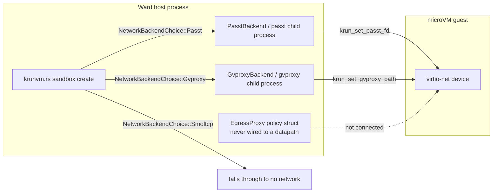
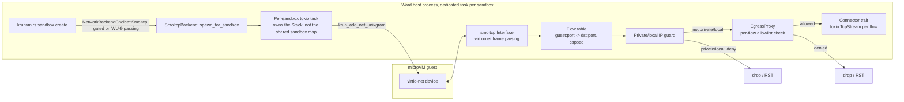
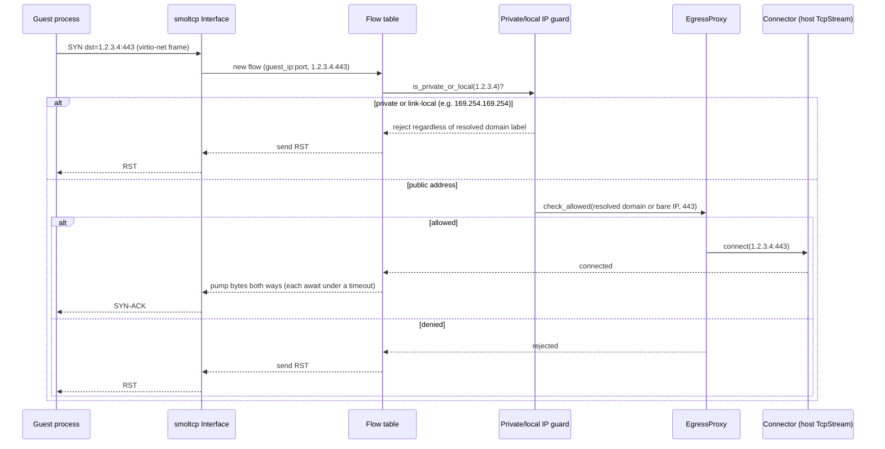

# ADR-019: In-Process smoltcp Networking as Default

- **Status:** Accepted (partially superseded by [ADR-020](020-smoltcp-only-networking.md))
- **Date created:** 2026-09-25
- **Date modified:** 2026-09-25

**Note (ADR-020):** This record kept `passt` and `gvproxy` as opt-in backends (Decision, Follow-up). ADR-020 removed both outright, ahead of the informal "run in production long enough" bar this record set, after real-hardware verification of the smoltcp path during ADR-019's own implementation. The rest of this record (promoting smoltcp to default) stands.

## Context

[ADR-018](018-rootless-networking.md) chose `passt` as Ward's default network backend and deferred an in-process `smoltcp` stack to "research, not blocking (v0.3+)". ADR-018 is still `Status: Proposed`, never finalized to Accepted.

This ADR was originally framed around eliminating `sudo` from Ward's install path entirely. That framing does not survive reading `install.sh` closely: the `sudo apt install passt` hint at `install.sh:425` prints only inside the block guarded by `[[ -e /dev/kvm ]] && ! [[ -r /dev/kvm && -w /dev/kvm ]]` (`install.sh:419`), the same block that opens with `sudo usermod -aG kvm $USER` (`install.sh:422`) — the one-time step needed to grant the invoking user KVM access on Linux at all. That `sudo` is required for **any** network backend, including this one; it has nothing to do with passt, gvproxy, or smoltcp. Removing the passt line does not remove Ward's only Linux `sudo` step. **This ADR does not make Ward's Linux install sudo-free.** That goal, if pursued, is a separate investigation (udev rules for `/dev/kvm` group membership, or similar) outside this ADR's scope.

What does still hold, independent of the sudo question:

- `passt` and `gvproxy` are both external binaries Ward must probe for, spawn, and supervise as child processes per sandbox (`ward-net/src/passt.rs:120-130`, `ward-net/src/gvproxy.rs`). Neither ships with Ward. `gvproxy` in particular pulls in a Go runtime, outside Ward's otherwise pure-Rust, SLSA L3, cargo-deny-audited supply chain.
- `EgressProxy` (`ward-core/src/egress/proxy.rs:42-121`) is a real policy struct (domain/IP allowlist matching, `matches_domain` at line 328) but is never wired into any packet datapath. The prior repo audit (`.local/repo-audit-2026-07-05.md`, confirmed still true at HEAD `4a02ced`) records that `EgressMode::Allowlist` is rejected outright at sandbox-create time (`ward-core/src/sandbox/manager.rs:182-190`) specifically because there is no datapath to enforce it against.
- The FFI surface for an in-process alternative already exists and is unused: `krun_add_net_unixstream`/`krun_add_net_unixgram` (`ward-core/src/backend/krun_ffi.rs:104,112`). ADR-018's Decision section (line 67 — "a `ward-net` crate that wraps the libkrun unixgram FD" — not its "Future work" section, which separately uses the looser term `libkrun_set_net_fd` at line 119) already names the unixgram FD as the transport a ward-owned smoltcp `Interface` would use. ADR-018's Context section (line 23, in its FD/socket options commentary) judged the FD/socket options "useful for *intra-host* routing but not for giving the guest internet egress" — that judgment was about what the FD options do *by themselves* (terminate a socket at the host). It does not apply once Ward puts a full smoltcp `Interface` and TCP/IP stack behind the FD, which is exactly the "Future work" ADR-018 scoped and deferred (line 114 onward), not a reversal of ADR-018's FD-option assessment.
- The groundwork already exists in code: `ward-net/src/lib.rs:84-100` defines a `NetworkBackend` trait implemented uniformly across backends, and `ward-net/src/smoltcp_backend.rs` is a scaffold behind the `smoltcp` Cargo feature that compiles against `smoltcp = "0.13"` (`ward-net/Cargo.toml:41`) but whose `attach` returns `Error::Unimplemented` (`detach` already returns `Ok(())`, a no-op scaffold rather than an error).

This ADR supersedes ADR-018's default-backend decision on the strength of the Allowlist-enforcement gap and the external-binary/supply-chain reasons above, not on a sudo-elimination claim.

## Decision Drivers

- **`Allowlist` mode has no enforcement point today.** An in-process stack is the natural place to filter per-flow against `EgressProxy`'s existing policy struct, closing a gap the prior repo audit flagged as the project's top Critical finding until it was fixed by rejecting `Allowlist` outright at `manager.rs:182-190`.
- **The FFI surface for the alternative is already committed and unused.** `krun_add_net_unixstream`/`krun_add_net_unixgram` (`krun_ffi.rs:104,112`) exist, are never called, and are exactly the entry points ADR-018 already named for a smoltcp `Interface`.
- **`gvproxy`'s Go runtime and both backends' per-sandbox child processes sit outside Ward's Rust/SLSA L3/cargo-deny supply-chain posture.** This is a real but bounded win: Ward already pins and checksum-verifies a prebuilt libkrun binary (`vendor/libkrun-version.txt`, `vendor/libkrun-checksums.txt`; no libkrun source or headers live in-tree), so "non-Rust dependency" is not eliminated by this change, only "non-Rust dependency Ward must spawn and supervise as a subprocess per sandbox" is.
- **Removing the passt/gvproxy process boundary is not a pure win and must be weighed as a cost, not just counted as removed supervision surface.** See Consequences.

## Considered Alternatives

### Keep passt as default, bundle a static binary to avoid installing it via a package manager (effort: S)

- Vendor a statically-linked `passt` binary in Ward's own release artifact (the same pattern already used for libkrun in `vendor/`), so `install.sh` places it in `$WARD_DATA_DIR/bin` instead of requiring `apt install passt`.
- Trade-offs: this is a materially smaller undertaking than it first appears, precisely because Ward already carries a vendored-C-binary release process for libkrun (`vendor/`) — bundling passt is the same problem solved a second time, not a new category of supply-chain work. It keeps passt's years of hardening and does not touch `gvproxy`'s Go-runtime dependency, and does not open a path to wiring `EgressProxy`, since passt filters at its own process boundary, opaque to Ward. That last point, not "supply chain liability", is the real reason this alternative doesn't solve the problem this ADR exists to solve: `Allowlist` enforcement needs a point in the datapath Ward's own code controls, and passt's process boundary is exactly the boundary that prevents that.

### Keep multi-backend, promote gvproxy to default (effort: S)

- Switch `NetworkBackendChoice::default()` from `Passt` to `Gvproxy`. `gvproxy` already speaks vsock, which Ward already uses for `ward-agent` (per ADR-018).
- Trade-offs: does not remove an external binary; swaps one package-manager dependency for another with strictly worse distro coverage (`gvproxy` ships mostly via Podman packages today, per ADR-018's own note). Does not open an `EgressProxy` enforcement point either, for the same process-boundary reason as passt. Rejected: solves neither driver this ADR is asked to solve.

### Full in-process smoltcp stack, promoted to default (effort: L)

- Complete `ward-net/src/smoltcp_backend.rs`: parse virtio-net frames off `krun_add_net_unixgram`, run a smoltcp `Interface`, maintain a flow table `(guest_ip, guest_port, dst_ip, dst_port) -> tokio::net::TcpStream`, pump bytes per flow, handle DNS/DHCP/ICMP in-stack, and check each flow against `EgressProxy` before connecting.
- Trade-offs: real engineering cost (ADR-018 estimated "weeks"; this ADR's blueprint breaks that into work units). In exchange: no external binary or package-manager step for networking specifically, pure-Rust in-tree code, and a real enforcement point for `EgressProxy`. Also a real cost this alternative must carry explicitly: Ward's own process now parses untrusted virtio-net frames from the guest, where before that parsing happened in a separate passt/gvproxy process. See Consequences for the blast-radius comparison.

## Decision

**Full in-process smoltcp stack, promoted to default.** `passt` and `gvproxy` remain in the codebase as opt-in backends (`WARD_NETWORK_BACKEND=passt|gvproxy`) for users who already have them installed and prefer their maturity — note `GvproxyBackend::attach` (`ward-net/src/gvproxy.rs:160-174`) is currently a placeholder stub that records a fake pid; the real gvproxy boot path is the free function `gvproxy::spawn_for_sandbox` called directly from `krunvm.rs:265-275`, not the trait method. `NetworkBackendChoice::default()` becomes `Smoltcp` only after the blueprint's end-to-end test (WU-9) passes in a real CI job — see the blueprint's Ordering table.

Rejected the bundled-static-passt alternative specifically because it cannot become an `EgressProxy` enforcement point (a process boundary that Ward's own policy code cannot see across), not because of a supply-chain argument — Ward already pins and checksum-verifies a prebuilt C dependency (libkrun) at the same trust level bundling passt would require.

Rejected promoting `gvproxy` to default for the same enforcement-point reason, plus its strictly worse distro/install coverage (ADR-018's own finding).

**Explicitly not a decision made here:** whether Ward's Linux install
can become fully sudo-free. That requires removing or automating the `/dev/kvm` group-membership step, unrelated to networking, and is out of scope for this ADR.

## Consequences

- **Positive:** no external binary or package-manager step for the network backend specifically. `Allowlist` egress mode becomes implementable instead of permanently rejected, provided the SSRF/ private-IP guard (blueprint WU-5) ships with it, not after it. Matches Ward's existing pure-Rust / SLSA L3 posture for the pieces that move in-process.
- **Negative — engineering cost:** real, security-relevant code has to be written and hardened in-house (DNS relay, DHCP server, ICMP echo, TCP flow table) rather than inherited from passt/gvproxy's years of production use.
- **Negative — blast radius, stated concretely:** today, a passt process that crashes or is exploited costs Ward one ~3 MB child process (ADR-018's own estimate) and that sandbox's networking; the Ward daemon itself, and every other sandbox's state, is unaffected. After this change, the code parsing untrusted guest network frames runs inside the same daemon process that holds every sandbox's krun context and process-table state (`krunvm.rs:128,145`). A bug in the new frame parser or flow table is a bug in that daemon, not in an isolated child. This is a real trade, not a net removal of attack surface, and the Decision Drivers above are written to reflect that rather than count child-process removal as a pure win.
- **Negative — narrowed guest network capability:** passt today translates guest TCP *and* UDP to host `socket(2)` calls (ADR-018). This blueprint's WU-3/WU-4 cover DNS, DHCP, ICMP, and TCP; general guest-initiated UDP egress (anything other than DNS) has no forwarding path in this blueprint and is out of scope. A sandbox running the smoltcp backend loses general UDP egress compared to the passt/gvproxy backends until a future work unit adds it.
- **Follow-up:** `passt`/`gvproxy` code paths stay in the tree as fallback/opt-in, not removed, until the smoltcp path has run in production long enough to justify deleting ~800 LOC of tested code. `install.sh:425`'s `sudo apt install passt` hint moves to only print when `WARD_NETWORK_BACKEND=passt` is explicitly set — this is a minor install-script cleanup, not a sudo-elimination measure; the `sudo usermod -aG kvm` step at `install.sh:422` is unaffected and expected to remain.

## Architecture Diagrams

### Current state

### Proposed state

### Sequence: sandbox egress connection (private/local IP guard runs in every egress mode; the allowlist check shown here is Allowlist-mode-specific, layered on top)

