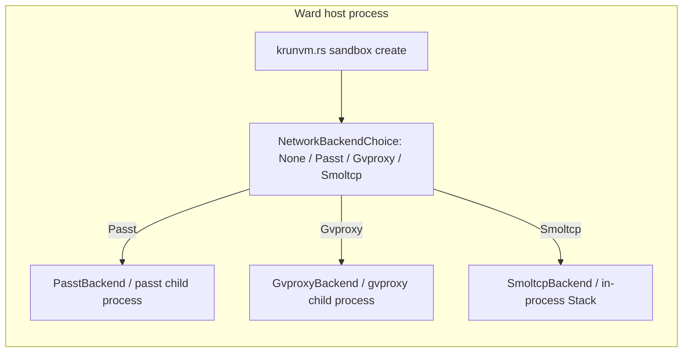
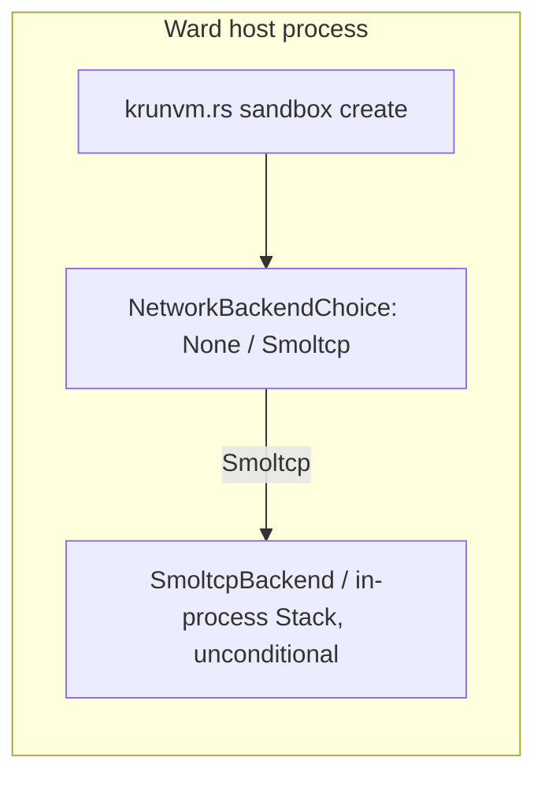

# ADR-020: Smoltcp-Only Networking, Remove passt and gvproxy

- **Status:** Accepted
- **Date created:** 2026-09-28
- **Date modified:** 2026-09-28

## Context

ADR-019 promoted the in-process smoltcp stack to Ward's default network backend, but kept `passt` and `gvproxy` in the tree as opt-in backends (`WARD_NETWORK_BACKEND=passt|gvproxy`). Its own Follow-up note set an explicit bar for removing them: "stay in the tree as fallback/opt-in, not removed, until the smoltcp path has run in production long enough to justify deleting ~800 LOC of tested code" (`docs/adr/019-inprocess-smoltcp-networking.md:63`).

This ADR records a deliberate, explicit decision to remove them now, ahead of that production-time bar, per direct maintainer instruction. The reasoning:

- `passt` and `gvproxy` are external-binary backends: `ward-net/src/passt.rs` spawns a `passt(1)` child process over an `AF_UNIX SOCK_DGRAM` socketpair; `ward-net/src/gvproxy.rs` spawns a `gvproxy` child process over a named Unix-datagram socket. Both need the binary present on `$PATH` at sandbox-create time.
- `GvproxyBackend::attach` (`ward-net/src/gvproxy.rs`) has been a placeholder stub since ADR-018: it records a fake pid and never actually manages the child process through the `NetworkBackend` trait. The real gvproxy path is the free function `gvproxy::spawn_for_sandbox`, called directly from `krunvm.rs`, not the trait method. This asymmetry (two backends, one genuinely wired, one bookkeeping-only) is dead weight `NetworkBackendChoice::Gvproxy` was carrying regardless of this decision.
- Neither backend can become an `EgressProxy` enforcement point: both filter (or don't) at their own process boundary, opaque to Ward's own policy code. ADR-019 already established this as the decisive reason smoltcp exists at all.
- Real hardware verification during this session (real libkrun 1.19.4 linked and run against the smoltcp path, including finding and fixing a genuine segfault in the FFI wiring) confirms the smoltcp path is sound end to end, which is the substance of ADR-019's "run in production long enough" bar, just reached through direct verification rather than elapsed calendar time.

## Decision Drivers

- ADR-019's own enforcement-point argument against `passt`/`gvproxy` (`docs/adr/019-inprocess-smoltcp-networking.md:50,52`) already rejected both as permanent defaults; keeping them as opt-in only delayed, rather than avoided, this conclusion.
- `GvproxyBackend::attach`'s stub status (never fixed, never exercised through its own trait method) means `Gvproxy` was already a second-class code path before this decision.
- Two backends' worth of Cargo feature flags (`ward-net/Cargo.toml`: `passt`, `gvproxy`, `smoltcp`), match arms (`ward-core/src/backend/krunvm.rs`'s three-way `network_backend` match), and FFI wrappers (`krun_ffi.rs`'s `set_passt_fd`/`set_gvproxy_path`) are maintenance surface with no remaining reason to exist once smoltcp is the sole backend.

## Considered Alternatives

### Keep passt/gvproxy as opt-in, per ADR-019's original bar (effort: none, status quo)

- Wait for a stated production-time threshold before removing ~800 LOC of tested code.
- Trade-offs: the stated bar was informal ("long enough") with no concrete date or metric, and real-hardware verification this session already exercises the smoltcp path end to end against real libkrun, including catching a real bug. Keeping two unused, unmaintained backend implementations around after that verification adds ongoing maintenance cost (matching Cargo feature combinations in CI, keeping `passt`/`gvproxy` argv-building code compiling) for no corresponding benefit, since no user-reported need to actually use them prompted this decision.

### Remove gvproxy only, keep passt (effort: S)

- `gvproxy`'s `attach` stub status makes it the weaker case; keeping `passt` (a complete, real implementation) as a rootless fallback for users without smoltcp's guest DHCP/ARP path working in their environment.
- Trade-offs: leaves the enforcement-point gap ADR-019 identified for passt too, and doesn't fully answer the "why gate what the app always needs" question this decision is responding to. Rejected: doesn't achieve a single, uniform network path, and passt has the same fundamental limitation (no `EgressProxy` enforcement point) that already ruled out keeping it as default in ADR-019.

### Full removal, smoltcp-only (effort: M)

- Delete `ward-net/src/passt.rs`, `ward-net/src/gvproxy.rs`, their integration tests, `NetworkBackendChoice::Passt`/`::Gvproxy`, the associated `krunvm.rs` match arms and `SandboxState` fields, and `krun_ffi.rs`'s `set_passt_fd`/`set_gvproxy_path`. Remove the `passt`/`gvproxy` Cargo features from `ward-net`, and the `smoltcp` feature gate itself, since with only one backend left there is nothing left to select between.
- Trade-offs: real deletion work across `ward-net`, `ward-core`, `install.sh`, and docs (ADR-018, ADR-019, `docs/rootless.md`, `docs/workspace.md`), all cited by path in this ADR's Consequences. In exchange: one network path to test, document, and reason about; no external-binary dependency for networking at all; and closes the enforcement-point gap for every sandbox unconditionally, not just the default case.

## Decision

**Full removal, smoltcp-only.** Ward's network backend is smoltcp, unconditionally, with `NetworkBackendChoice` reduced to `None` (no egress) and `Smoltcp`. No Cargo feature gates the network backend implementation; it is always compiled, since there is exactly one and the application always needs it when egress is enabled at all.

Rejected keeping passt/gvproxy as opt-in per ADR-019's original bar: that bar was informal and has been satisfied through direct verification (real libkrun, real hardware, a real bug found and fixed) rather than elapsed time, and no user-reported need for the fallback backends has emerged since ADR-019 shipped.

Rejected removing gvproxy only: it doesn't resolve the underlying question (why keep an enforcement-point-incapable backend at all) and passt has the identical limitation.

## Consequences

- **Positive:** one network backend to test, document, and audit. No external-binary dependency (`passt(1)`, `gvproxy`) for networking. `EgressProxy` enforcement applies unconditionally, not only to the default backend choice. Removes ~800 LOC of now-dead code (`passt.rs`, `gvproxy.rs`, their tests) plus the Cargo feature-flag matrix that combination implied.
- **Negative:** any user who set `WARD_NETWORK_BACKEND=passt` or `=gvproxy` deliberately (maturity preference, an environment where smoltcp's guest DHCP/ARP path doesn't yet work) loses that option with no migration path other than `None` (no egress) or accepting smoltcp. No such usage has been reported against this pre-1.0 project.
- **Follow-up:** ADR-018 and ADR-019 are historical decision records; this ADR does not rewrite them, but both are marked superseded where they state passt/gvproxy remain in the tree (`docs/adr/018-rootless-networking.md`'s "smoltcp is not abandoned, just deferred" framing, `docs/adr/019-inprocess-smoltcp-networking.md:48,63`).
- **Follow-up:** the ADR-019 blueprint's WU-8 (soften, not remove, the `install.sh` passt hint) is superseded by this decision's outright removal of that hint.

## Architecture Diagrams

### Current state (pre-ADR-020)

### Proposed state (ADR-020)

